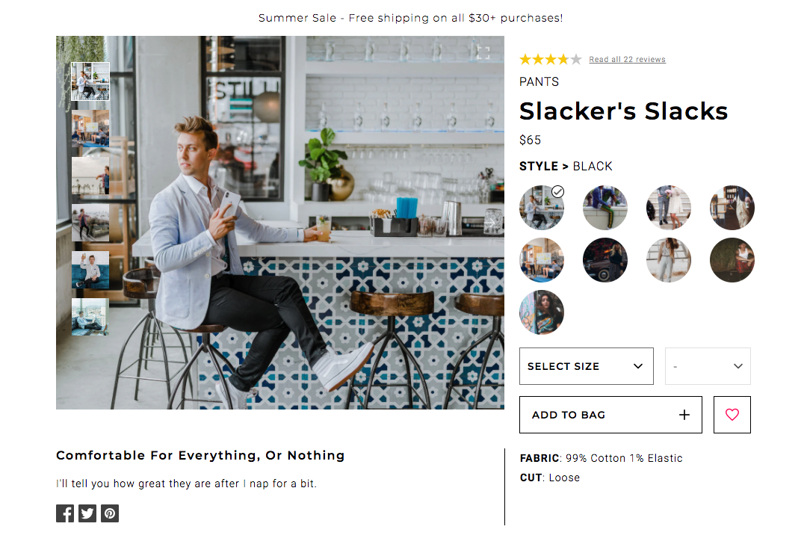
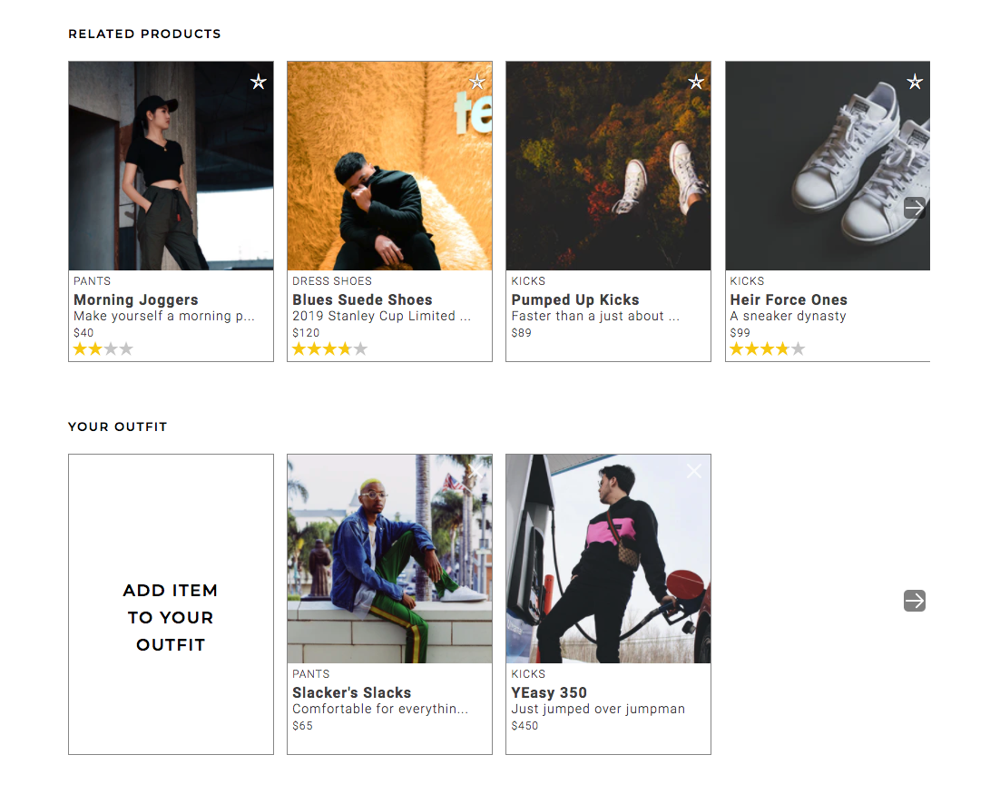
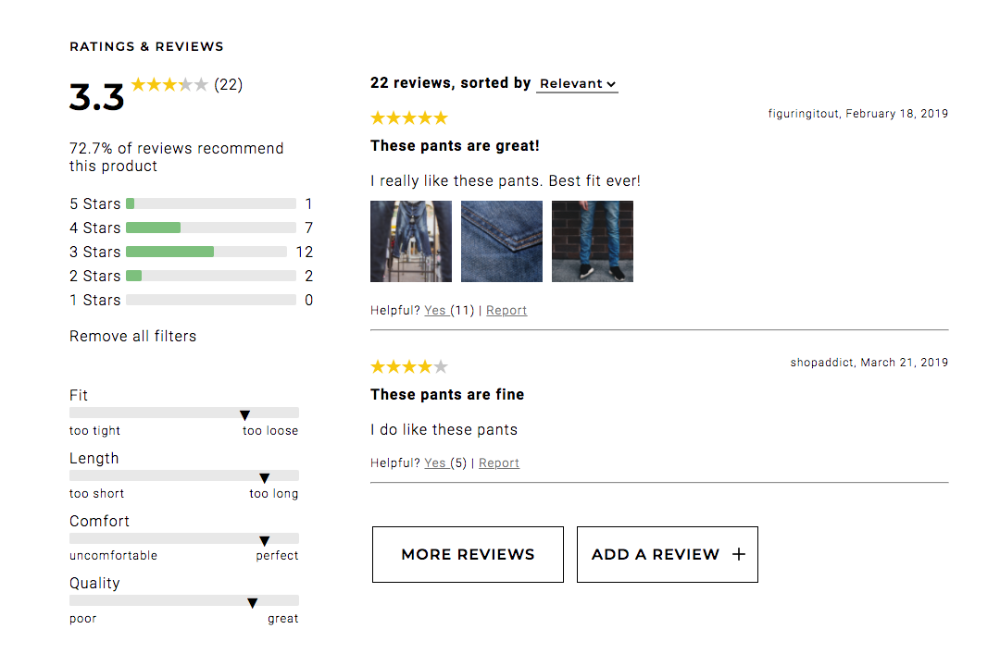

# Blázar

> Blázar is a client-facing retail web-portal designed and modernized to fulfill business requirements. An interactive user interface was created allowing customers to browse items in our retail catalog.

#### Product Detail
> The top-most section on the Product Detail page. This component will guide the customer through selecting a specific style and size to add to their cart.



#### Related Items & Outfit Creation
> The Related Items section will display two sets of related products. The first set will be a list of products, determined internally, that are related to the product currently being viewed. The second set will be a list, custom created by the user, of products which the user has grouped with the current product into an ‘outfit’.



#### Ratings & Reviews
> The Ratings & Reviews section will allow viewing and submission of reviews for the product selected. This component will extend the ability to write, read, and browse through reviews for the current product. All reviews will be saved per product.



## Installation

```
npm install
```
```
npm run dev-react
```
```
npm start
```

## Usage

Open the file `client/dist/index.html` or `http://localhost:5050` in your browser

## Testing

```
npm test
```

## Contributors

Shelley Chen\
Eric Weiner\
Michael Doudy